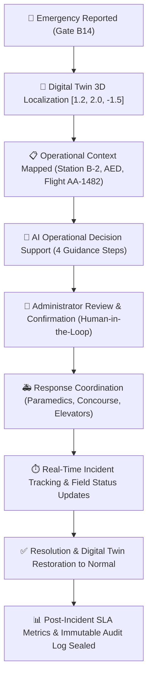

# TWINOS™ — Medical Emergency Operations Module

## 1. System Overview & Core Philosophy

**TwinOS is an Airport Digital Twin Operational Decision-Support Hub, NOT a clinical diagnosis or treatment platform.**

In an airport environment with hundreds of concurrent flights, crowded gate concourses, restricted access checkpoints, and tight turnaround SLAs, a passenger emergency is fundamentally an **operational coordination challenge**:
- Where is the emergency located in 3D physical airport space?
- Which certified response station is nearest?
- How is boarding and passenger concourse congestion managed around the gate?
- Can elevator transit and service corridors be prioritized for rapid paramedic access?
- What are the flight delays and ground turnaround impacts?

---

## 2. Key Architecture & Features

### A. Human-in-the-Loop (HITL) Governance
- **Strict Scope Boundaries**: TwinOS **never** diagnoses medical conditions, prescribes medication, or autonomously dispatches emergency personnel.
- **AI Operational Recommendations**:
  1. **Airport Medical Response Unit (Station B-2)**: Alert nearest certified medical team (300m / 4 min via Service Corridor 2B).
  2. **Terminal B Operations Supervisor**: Deploy crowd control marshals to establish a 10m perimeter around Gate B14.
  3. **Elevator E4 Priority Access Mode**: Pre-emptively engage vertical transit recall to save ~90s transit time.
  4. **Gate B14 Boarding Hold Advisory**: Pause boarding for Flight AA-1482 to prevent jetbridge bottlenecking.
- **Confirmation Modals**: Every operational action requires explicit Administrator authorization with optional field notes and logs the administrator ID.

### B. Digital Twin 3D Localization
- **Coordinates**: Gate B14 `[1.2, 2.0, -1.5]` (Terminal B North Concourse).
- **Interactive Spatial Marker**:
  - **Active Emergency**: High-visibility glowing red badge with pulse beacon and live critical indicator.
  - **Resolved**: Switches to green `Gate B14 — Normal Operations`.
  - **Interactive Click**: Focuses camera smoothly on Gate B14 and opens the Emergency Operations Slide-over Drawer.

### C. Live Operational Context
- **Nearest Medical Station**: First Aid Station B-2 (0.3 km / Concourse Level 2).
- **Nearest AED**: Column B14-East (15m from Gate Podium).
- **Passenger Density**: High (~184 passengers nearby in Gate B14 seating).
- **Flight Impact**: AA-1482 to DFW (Departure: 14:45, Boarding Active).
- **Transit Route**: Service Corridor 2B via Elevator E4 (clearance status monitored).
- **CCTV Feed**: Simulated live stream `CAM-TB-B14-NORTH` with timestamp and 30 FPS telemetry.

### D. Response Coordination & Audit Trail
- **Medical Response Team Tracking**: `PENDING NOTIFICATION` → `NOTIFIED` → `EN ROUTE` → `ON SCENE`.
- **Concourse Operations Tracking**: `MONITORING` / `CROWD CONTROL REQUESTED` / `GATE HOLD ACTIVE` / `CLEAR`.
- **Elevator E4 Routing**: `STANDARD` / `PRIORITY ACTIVE`.
- **Dynamic Chronological Audit Stream**: Every action, note, dispatch, escalation, and resolution is timestamped with actor credentials.
- **SLA Metrics & Export**:
  - Time to Acknowledge (< 60s target)
  - Time to Dispatch (< 2 min target)
  - Time to On-Scene (< 6 min target)
  - Total Resolution Time
  - 1-Click **Export Audit Report (JSON)** download for airport compliance records.

---

## 3. End-to-End Demonstration Walkthrough

| Step | Action | Description |
| :--- | :--- | :--- |
| **1** | **Report / Test Incident** | Click **`TEST INCIDENT (B14)`** in the Top Navigation Bar, or click **`+ REPORT EMERGENCY`** and submit the modal. |
| **2** | **3D Twin Localization** | Camera automatically pans to Gate B14 `[1.2, 2.0, -1.5]`. Pulsing red marker appears above Gate B14. Audible alert sounds. |
| **3** | **Emergency Drawer Opens** | Live elapsed timer starts ticking. Concourse context, Flight AA-1482 status, and AED proximity are displayed. |
| **4** | **Acknowledge Incident** | Click **`ACKNOWLEDGE INCIDENT`**. Status transitions to `ACKNOWLEDGED`. Audit log is updated. |
| **5** | **Review AI Guidance** | Under *Context & AI Guidance*, click **`APPROVE & DISPATCH`** on *Notify Airport Medical Response Unit*. The Human-in-the-Loop dialog prompts for confirmation. |
| **6** | **Authorize & Dispatch** | Click **`Confirm & Dispatch Action`**. Status advances to `RESPONSE_INITIATED`, dispatch timestamp is recorded. |
| **7** | **Field Status Advance** | Under *Response Tracking*, click **`Mark En Route`** then **`Mark On Scene`**. Status transitions to `RESPONDING`. |
| **8** | **Resolve Incident** | Click **`RESOLVE INCIDENT`**. Select outcome (e.g. `Treated On-Site & Cleared`), verify Gate B14 normal restoration checkbox, and confirm. |
| **9** | **Digital Twin Restoration** | Marker updates to green **`Gate B14 — Normal Operations`**. Status advances to `RESOLVED`. Confetti triggers. |
| **10** | **Export Compliance Audit** | Under *Resolution SLA*, review SLA compliance metrics and click **`EXPORT COMPLETE AUDIT REPORT (JSON)`** to download the signed incident report. |
